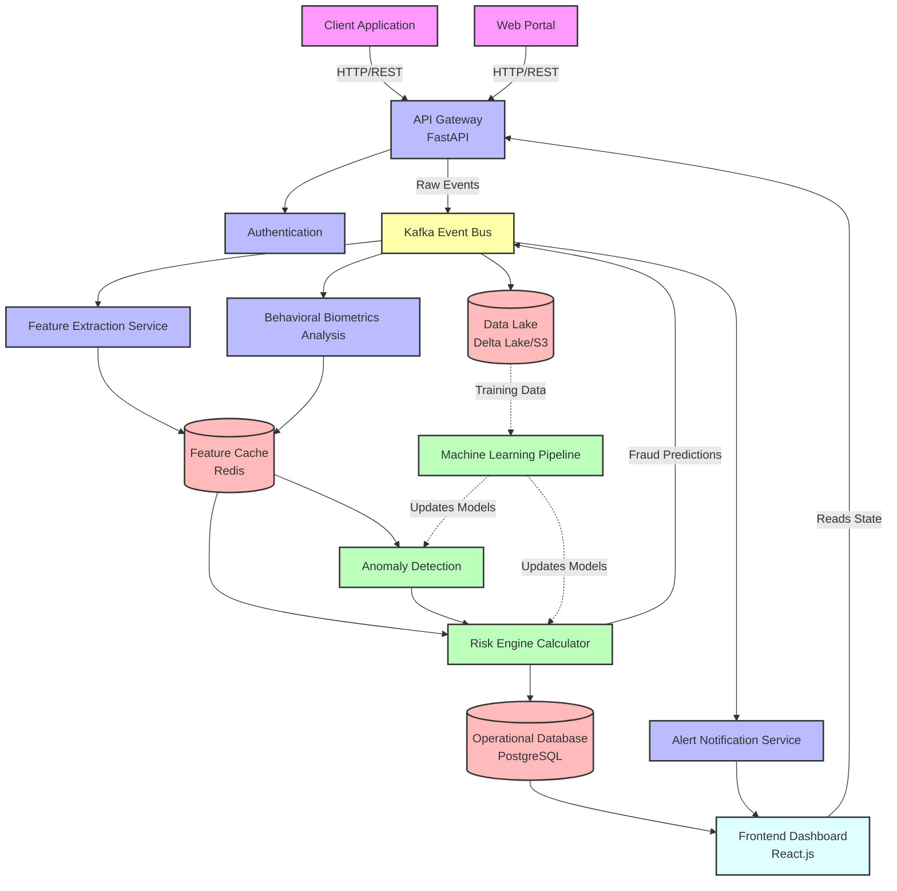

# Fraud Detection Platform Architecture

The system is composed of several independent services that work together to detect fraudulent activities in real-time.

## Description of Components

1. **Ingestion Layer:** The `API Gateway` acts as the single entry point for all transaction and behavior logs, performing basic authentication before forwarding logs as events.
2. **Streaming Engine:** `Kafka Event Bus` allows multiple asynchronous services to subscribe to raw transaction events (for processing, logging, scaling, etc.) without blocking the main API response path.
3. **Data Processing:** Specialized workers such as the `Feature Extraction Service` and `Behavioral Biometrics Analysis` enrich the transactions with historical aggregated features derived from real-time streams and fetched from a quick `Feature Cache`.
4. **Machine Learning & Risk Engine:** Using loaded models, incoming events are evaluated by `Anomaly Detection` models (like Isolation Forests) and rule-based or supervised models within the `Risk Engine Calculator` to assign a definitive risk score.
5. **Storage:** Relational `Operational Database` holds finalized transaction states, user data, and risk decisions. The `Data Lake` stores all historical raw events for offline `Machine Learning Pipeline` training. 
6. **Actions & Dashboard:** The `Alert Notification Service` triggers if thresholds are crossed, sending out emails/SMS mapping to High-Risk actions. A `Frontend Dashboard` offers security teams interactive insights and reports.
